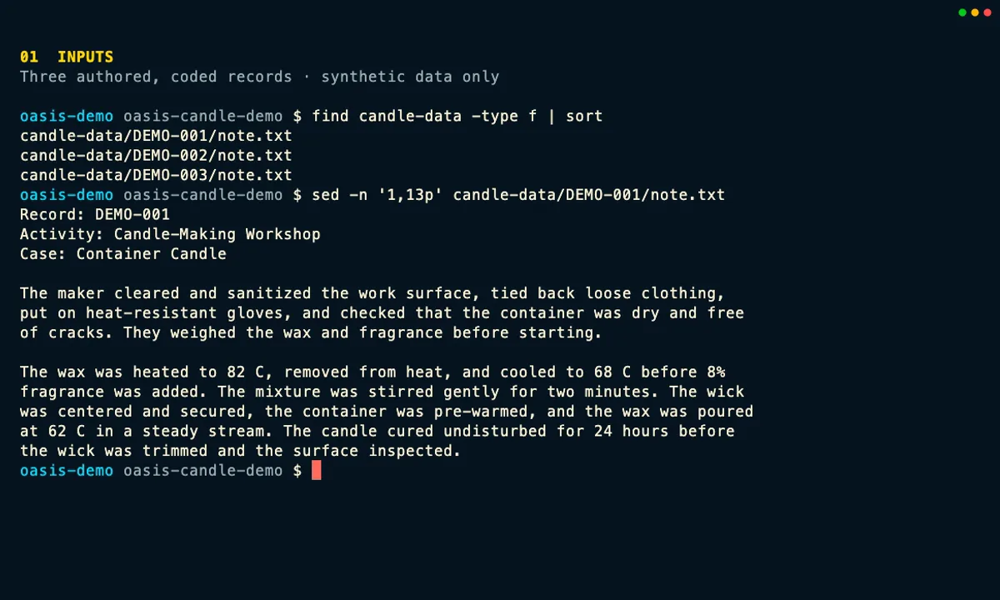

::: {.tour-intro}
Follow three newly authored, coded Candle Making notes through a real OASIS CLI and MCP workflow. For this recording, OASIS talks only to a predictable OpenAI-compatible test service running on the same machine. No note leaves the computer, no external model provider is called, and nothing is billed. The scores and token counts are prepared fixture values, not judgments from a live model.
:::

::: {#candle-tour .tui-explorer data-product-tour="" data-tour-id="candle-cli-mcp"}
::: {.tui-explorer-topline}
::: {.tui-explorer-heading}
::: {.eyebrow}
Recorded standalone walkthrough
:::

<h2 data-role="title">Start with three clearly defined demo notes</h2>

Before OASIS reads anything, check the three coded notes, the Candle Making rubric, and the dedicated output folder.

:::

::: {.tour-status aria-label="Tour execution status"}

Real CLI &amp; MCP · local test fixture · $0 paid
:::
:::

  <button type="button" role="tab" id="candle-tab-inputs" aria-controls="candle-tour-stage" aria-selected="true" tabindex="0" data-role="tab" data-step="inputs">1 · Inputs</button>
  <button type="button" role="tab" id="candle-tab-data" aria-controls="candle-tour-stage" aria-selected="false" tabindex="-1" data-role="tab" data-step="data">2 · Data checks</button>
  <button type="button" role="tab" id="candle-tab-rubric" aria-controls="candle-tour-stage" aria-selected="false" tabindex="-1" data-role="tab" data-step="rubric">3 · Rubric</button>
  <button type="button" role="tab" id="candle-tab-plan" aria-controls="candle-tour-stage" aria-selected="false" tabindex="-1" data-role="tab" data-step="plan">4 · Plan</button>
  <button type="button" role="tab" id="candle-tab-sample" aria-controls="candle-tour-stage" aria-selected="false" tabindex="-1" data-role="tab" data-step="sample">5 · Sample</button>
  <button type="button" role="tab" id="candle-tab-run" aria-controls="candle-tour-stage" aria-selected="false" tabindex="-1" data-role="tab" data-step="run">6 · Full run</button>
  <button type="button" role="tab" id="candle-tab-mcp" aria-controls="candle-tour-stage" aria-selected="false" tabindex="-1" data-role="tab" data-step="mcp">7 · MCP cache run</button>
  <button type="button" role="tab" id="candle-tab-evidence" aria-controls="candle-tour-stage" aria-selected="false" tabindex="-1" data-role="tab" data-step="evidence">8 · Evidence</button>

::: {#candle-tour-stage .tui-stage data-role="stage" role="tabpanel" aria-labelledby="candle-tab-inputs" tabindex="0"}
::: {.terminal-window}
<picture data-role="poster-frame">
  <source data-role="poster-source" type="image/webp" srcset="assets/candle/candle-01-inputs-poster.webp">
  
</picture>

::: {.terminal-fallback data-tour-placeholder="" aria-hidden="true"}
INPUTS
<strong data-role="placeholder-detail">Start with three coded notes and one explicit rubric.</strong>
Recorded preview unavailable
:::
:::
:::

::: {.tour-controls}
<button type="button" class="tour-button" data-role="previous" disabled>← Previous step</button>
<button type="button" class="tour-button tour-button-primary" data-role="next">Next step →</button>
<button type="button" class="tour-button" data-role="watch" disabled>Watch the complete CLI flow</button>
<a class="tour-deep-link" data-role="deep-link" href="#inputs" aria-label="Link to the current Candle walkthrough step">Link to this step</a>
:::

<noscript>

Interactive controls require JavaScript. <a href="#candle-transcript">Read the complete transcript and CLI-to-MCP mapping</a> below without JavaScript.

Jump to: <a href="#inputs">Inputs</a> · <a href="#data">Data checks</a> · <a href="#rubric">Rubric</a> · <a href="#plan">Plan</a> · <a href="#sample">Sample</a> · <a href="#run">Full run</a> · <a href="#mcp">MCP cache run</a> · <a href="#evidence">Evidence</a>.

</noscript>

:::

::: {.tour-notes}
::: {.tour-note-card}
### Real OASIS code

The recording runs binaries built from a clean OASIS source tree at `db2861fdc79aa3bddeaed949c1282e068e7f4eb9`. It uses the real CLI, MCP server, model-service connector, parser, cache, and evidence code.
:::

::: {.tour-note-card}
### A safe stand-in for a model

The model-compatible endpoint is a local test service that always returns the same prepared responses—not OpenAI, Anthropic, Gemini, or another live model. The full run makes three requests to that service. External provider calls and paid spend remain zero.
:::

::: {.tour-note-card}
### Estimates are not charges

Before execution, the zero-call plan shows a conservative rough estimate of $0.010096; it is not added to observed capture usage. The sample reports 360 tokens from the test service and a $0.00084 usage estimate; the full run reports 1,080 tokens and $0.00252. Together, the sample and full run account for 1,440 tokens and a $0.00336 estimate. These are accounting estimates, not provider charges: paid spend is $0, and the MCP cache run adds $0.
:::
:::

::: {.tour-method}
## CLI and MCP: two ways to run the same workflow

The MCP view comes from the real messages exchanged with the OASIS server; it is not a simulated agent chat. The server can access only the synthetic fixture and output folders. After the CLI completes the run, a new MCP request for identical content reuses all three results from cache, adding no local test-service requests, reported tokens, or estimated cost.

| What you want to do | CLI command | MCP tool |
|---|---|---|
| Validate readable inputs | `oasis --format json data validate candle-data` | `oasis.data.validate` |
| Discover records and hashes | `oasis --format json data scan candle-data --rubric rubric/candle-rubric.yaml --hash --summary-only --output evidence/capture/intake-manifest.json` | `oasis.data.scan` |
| Check rubric structure and scoring logic | `oasis --format json rubric check rubric/candle-rubric.yaml --strict` | `oasis.rubric.check` |
| Build the plan and resolve station mapping | `oasis --format json --trace-id candle-plan auto-grade candle-data --rubric rubric/candle-rubric.yaml --provider openai-compatible --output output/capture-plan --max-files 10 --hash --no-transcript --depth shallow` | `oasis.pipeline.auto_grade` |
| Run one-record sample | `oasis --format json --trace-id candle-sample auto-grade candle-data --rubric rubric/candle-rubric.yaml --provider openai-compatible --output output/capture-sample --max-files 10 --hash --standalone --sample 1 --concurrency 1 --no-cache --no-transcript --depth shallow` | `oasis.pipeline.auto_grade` |
| Run the full fixture | `oasis --format json --trace-id candle-run auto-grade candle-data --rubric rubric/candle-rubric.yaml --provider openai-compatible --output output/capture-run --max-files 10 --hash --standalone --skip-sample --concurrency 1 --no-transcript --depth shallow` | `oasis.pipeline.auto_grade` |
| Summarize a completed run | `oasis --format json summary output/capture-run --depth prompt` | `oasis.summary` |
| Inspect results and verify evidence | `oasis --format json inspect output/capture-run --verify --provenance` | `oasis.inspect` |
| Review the broader audit ledger (available; not invoked in the clip) | `oasis ledger --limit 10` | `oasis.ledger` |

Except for the clearly marked ledger row, the table lists the exact commands used in the recording. The paths are relative to its working folder, and the commands use its local provider and model settings; outside this demo, configure a supported provider for your own environment. The recording also turns on OASIS audit output so the actions can be checked afterward.

In the MCP session, `oasis.data.scan` confirms that the records and their hashes were discovered. It does not return a station mapping; the mapping shown here comes from the CLI scan with `--rubric` and the auto-grade plan. The local test helper existed only during capture, and visitors never contact it.

In this tour, **intake** means checking and discovering local files. It does not mean uploading data to Elephant or another managed data service. Visitors receive only the static page and any recorded media they choose to play; they do not start OASIS, contact the local test fixture, or call a provider.

## Complete recorded transcript

Read the eight-step walkthrough without JavaScript

<ol>
<li><noscript></noscript><strong>Inputs:</strong> Start with three newly authored text notes named DEMO-001, DEMO-002, and DEMO-003, the Candle Making rubric, and an empty output folder. The record IDs are codes, not people.</li>
<li><noscript></noscript><strong>Data checks:</strong> Confirm that all three files are readable, then scan them with the rubric and record their hashes. OASIS recognizes three text-note records for the Candle Making station. This is a local check, not an upload to a managed service.</li>
<li><noscript></noscript><strong>Rubric:</strong> Run the strict check. It accepts the three text-note criteria and their scoring rules before any assessment request or estimated cost can occur.</li>
<li><noscript></noscript><strong>Plan:</strong> Ask OASIS for a dry-run plan. It resolves three encounters and three expected requests, records the selected fixture model, and shows a conservative rough pre-run estimate of $0.010096. Planning makes zero assessment calls, so this rough estimate is not added to the capture’s post-execution usage accounting.</li>
<li><noscript></noscript><strong>Sample:</strong> Try one record first. One local request returns one result with three item scores, 360 test-service tokens, and a $0.00084 OASIS estimate. The response follows the normal model-service and parsing path, so its score, rationale, and evidence can be checked before all three records run.</li>
<li><noscript></noscript><strong>Full run:</strong> Run all three coded records. The CLI makes three HTTP requests to the predictable local test service and records nine prepared scores plus 1,080 test-service tokens. The full-run OASIS estimate is $0.00252. Together, the trial and full run make four local requests and record a $0.00336 estimate; external provider calls and actual paid spend remain zero.</li>
<li><noscript></noscript><strong>MCP cache run:</strong> Start the real OASIS MCP server and call its defined tools. A new auto-grade request for the same three-record assessment finds three cache hits, so it adds no local test-service requests, reported tokens, or estimated cost. The transcript labels MCP messages clearly and does not pretend to be a named model or chat product.</li>
<li><noscript></noscript><strong>Evidence:</strong> Use summary and inspection to keep the results connected to their source files, rubric, plan, cache status, and model-service details. Verification confirms all 22 digital fingerprints for the recorded CLI evidence. The ledger command remains available for reviewing the broader audit trail.</li>
</ol>

The [public capture manifest](assets/candle/manifest.json) records the exact software version, binary and media hashes, run counts, privacy review, and confirmation that no external provider was used. The notes, rubric wording, scores, rationales, and test responses were written for this demonstration; none is learner, student, patient, or customer data.

[Explore every tour](explore.qmd) · [Open the CLI & TUI tour](tui.qmd) · [Open the MAPLES tour](maples.qmd) · [Return home](index.qmd)
:::

