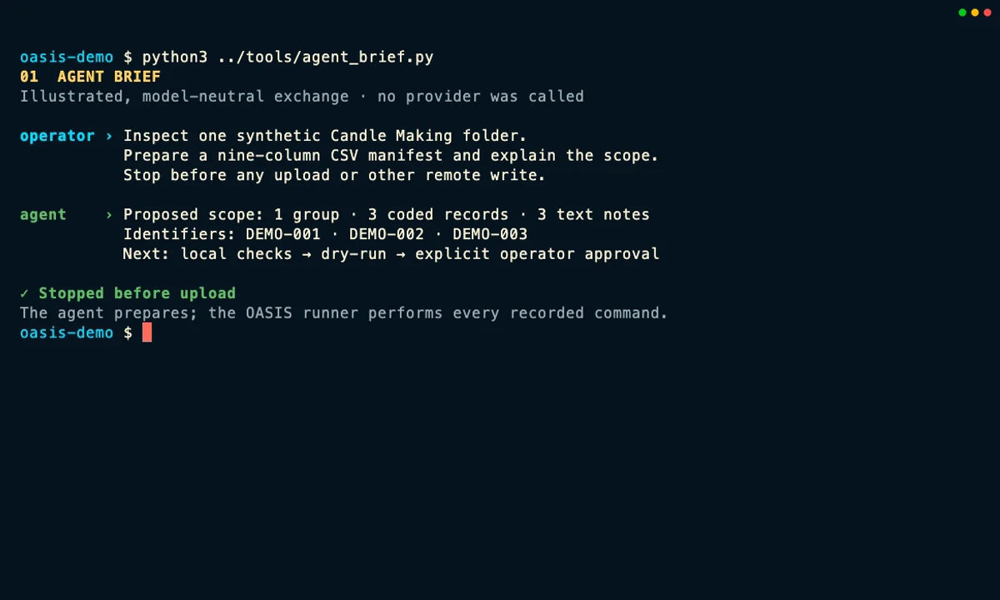

::: {.tour-intro}
Follow three coded Candle Making notes from a local folder into a clean Elephant demo service. An agent can inspect the folder and prepare the manifest, but OASIS performs the checks and import. The walkthrough pauses for approval before anything is written, then uses the TUI and read-only CLI commands to show exactly what arrived.

The agent exchange is a model-neutral illustration, not a transcript from Claude, Codex, Grok, or another named product. The recorded import uses only synthetic data and a local Elephant service. Visitors see an offline replay; opening this page contacts neither Elephant nor a model provider.
:::

::: {#elephant-tour .tui-explorer data-product-tour="" data-tour-id="elephant-ingestion"}
::: {.tui-explorer-topline}
::: {.tui-explorer-heading}
::: {.eyebrow}
Agent-assisted Elephant walkthrough
:::

<h2 data-role="title">Tell the agent what it may prepare</h2>
<p data-role="summary">Ask the agent to inspect one synthetic folder, draft an import manifest, and stop before any upload.</p>
:::

::: {.tour-status aria-label="Tour execution status"}
<span class="tour-status-dot" aria-hidden="true"></span>
<span>Recorded locally · made-up Candle records · checked and loaded with OASIS</span>
:::
:::

<div class="tui-tour-tabs" role="tablist" aria-label="Elephant ingestion and verification steps">
  <button type="button" role="tab" id="elephant-tab-agent-brief" aria-controls="elephant-tour-stage" aria-selected="true" tabindex="0" data-role="tab" data-step="agent-brief">1 · Agent brief</button>
  <button type="button" role="tab" id="elephant-tab-local-checks" aria-controls="elephant-tour-stage" aria-selected="false" tabindex="-1" data-role="tab" data-step="local-checks">2 · Local checks</button>
  <button type="button" role="tab" id="elephant-tab-import-preview" aria-controls="elephant-tour-stage" aria-selected="false" tabindex="-1" data-role="tab" data-step="import-preview">3 · Preview</button>
  <button type="button" role="tab" id="elephant-tab-human-approval" aria-controls="elephant-tour-stage" aria-selected="false" tabindex="-1" data-role="tab" data-step="human-approval">4 · Approval</button>
  <button type="button" role="tab" id="elephant-tab-import-run" aria-controls="elephant-tour-stage" aria-selected="false" tabindex="-1" data-role="tab" data-step="import-run">5 · Import</button>
  <button type="button" role="tab" id="elephant-tab-dataset" aria-controls="elephant-tour-stage" aria-selected="false" tabindex="-1" data-role="tab" data-step="dataset">6 · Group</button>
  <button type="button" role="tab" id="elephant-tab-encounters" aria-controls="elephant-tour-stage" aria-selected="false" tabindex="-1" data-role="tab" data-step="encounters">7 · Encounters</button>
  <button type="button" role="tab" id="elephant-tab-files" aria-controls="elephant-tour-stage" aria-selected="false" tabindex="-1" data-role="tab" data-step="files">8 · Files</button>
  <button type="button" role="tab" id="elephant-tab-file-details" aria-controls="elephant-tour-stage" aria-selected="false" tabindex="-1" data-role="tab" data-step="file-details">9 · Read-back</button>
</div>

::: {#elephant-tour-stage .tui-stage data-role="stage" role="tabpanel" aria-labelledby="elephant-tab-agent-brief" tabindex="0"}
::: {.terminal-window}
<picture data-role="poster-frame">
  <source data-role="poster-source" type="image/webp" srcset="assets/elephant/elephant-01-agent-brief-poster.webp">
  
</picture>

::: {.terminal-fallback data-tour-placeholder="" aria-hidden="true"}
<span class="fallback-kicker" data-role="placeholder-title">AGENT BRIEF</span>
<strong data-role="placeholder-detail">Prepare the manifest, explain the plan, and stop before writing anything.</strong>
<span data-role="placeholder-status">Recorded preview unavailable</span>
:::
:::
:::

::: {.tour-controls}
<button type="button" class="tour-button" data-role="previous" disabled><span aria-hidden="true">←</span> Previous step</button>
<button type="button" class="tour-button tour-button-primary" data-role="next">Next step <span aria-hidden="true">→</span></button>
<button type="button" class="tour-button" data-role="watch" disabled>Watch the complete import and browse flow</button>
<a class="tour-deep-link" data-role="deep-link" href="#agent-brief" aria-label="Link to the current Elephant walkthrough step">Link to this step</a>
:::

<div class="visually-hidden" data-role="live" aria-live="polite"></div>

<noscript>
<p class="tour-noscript">Interactive controls require JavaScript. <a href="#elephant-transcript">Read the complete nine-step walkthrough</a> below without JavaScript.</p>
<p class="tour-noscript tour-noscript-steps">Jump to: <a href="#agent-brief">Agent brief</a> · <a href="#local-checks">Local checks</a> · <a href="#import-preview">Preview</a> · <a href="#human-approval">Approval</a> · <a href="#import-run">Import</a> · <a href="#dataset">Group</a> · <a href="#encounters">Encounters</a> · <a href="#files">Files</a> · <a href="#file-details">Read-back</a>.</p>
</noscript>

<script type="application/json" data-product-tour-data>
{
  "id": "elephant-ingestion",
  "steps": [
    {
      "id": "agent-brief",
      "label": "1 · Agent brief",
      "title": "Tell the agent what it may prepare",
      "summary": "Ask the agent to inspect one synthetic folder, draft an import manifest, and stop before any upload.",
      "poster": {
        "src": "assets/elephant/elephant-01-agent-brief-poster.webp",
        "srcset": "assets/elephant/elephant-01-agent-brief-poster.webp",
        "type": "image/webp",
        "alt": "Illustrated model-neutral agent exchange proposing a three-record Elephant import and stopping before any upload.",
        "width": 1200,
        "height": 720
      },
      "media": null,
      "placeholder": {
        "title": "AGENT BRIEF",
        "detail": "Prepare the manifest, explain the plan, and stop before writing anything.",
        "status": "Recorded preview unavailable"
      }
    },
    {
      "id": "local-checks",
      "label": "2 · Local checks",
      "title": "Check and fingerprint the files locally",
      "summary": "OASIS confirms that the three note files are readable, records a hashed scan as evidence, and stops if anything still needs clarification. Nothing is sent to Elephant.",
      "poster": {
        "src": "assets/elephant/elephant-02-local-checks-poster.webp",
        "srcset": "assets/elephant/elephant-02-local-checks-poster.webp",
        "type": "image/webp",
        "alt": "OASIS terminal showing local validation and a hashed scan of three synthetic Candle Making notes.",
        "width": 1200,
        "height": 720
      },
      "media": null,
      "placeholder": {
        "title": "LOCAL CHECKS",
        "detail": "Confirm that the files are readable and fingerprint the set before import.",
        "status": "Recorded preview unavailable"
      }
    },
    {
      "id": "import-preview",
      "label": "3 · Preview",
      "title": "Preview the import with zero API calls",
      "summary": "The dry run reads the separate CSV manifest and all three files, reports what would be created, and makes no Elephant API call or change.",
      "poster": {
        "src": "assets/elephant/elephant-03-import-preview-poster.webp",
        "srcset": "assets/elephant/elephant-03-import-preview-poster.webp",
        "type": "image/webp",
        "alt": "OASIS data import dry run previewing one group, three coded records, and three text-note files with zero API calls.",
        "width": 1200,
        "height": 720
      },
      "media": null,
      "placeholder": {
        "title": "IMPORT PREVIEW",
        "detail": "Read the real manifest and files without contacting Elephant.",
        "status": "Recorded preview unavailable"
      }
    },
    {
      "id": "human-approval",
      "label": "4 · Approval",
      "title": "Approve this exact file set",
      "summary": "Review the target, counts, manifest fingerprint, and file-set fingerprint. If any input changes, the approval expires and the preview must run again.",
      "poster": {
        "src": "assets/elephant/elephant-04-human-approval-poster.webp",
        "srcset": "assets/elephant/elephant-04-human-approval-poster.webp",
        "type": "image/webp",
        "alt": "Terminal approval gate binding the local Elephant target and three-record import to reviewed manifest and file-set fingerprints.",
        "width": 1200,
        "height": 720
      },
      "media": null,
      "placeholder": {
        "title": "APPROVAL",
        "detail": "Bind approval to the reviewed target, manifest, and files.",
        "status": "Recorded preview unavailable"
      }
    },
    {
      "id": "import-run",
      "label": "5 · Import",
      "title": "Run the reviewed import",
      "summary": "The runner gives the unchanged manifest to OASIS, which creates or reuses the records in the local Elephant service and reports every success or failure.",
      "poster": {
        "src": "assets/elephant/elephant-05-import-run-poster.webp",
        "srcset": "assets/elephant/elephant-05-import-run-poster.webp",
        "type": "image/webp",
        "alt": "Completed OASIS import into a local Elephant service showing the reviewed synthetic records and zero failed rows.",
        "width": 1200,
        "height": 720
      },
      "media": {
        "webm": "assets/elephant/elephant-overview.webm",
        "mp4": "assets/elephant/elephant-overview.mp4",
        "title": "Elephant ingestion and browse walkthrough",
        "caption": "Watch the recorded local workflow move from agent preparation and OASIS checks through approval, import, TUI browsing, and a read-only file metadata check. Only synthetic data is used."
      },
      "placeholder": {
        "title": "IMPORT",
        "detail": "Send only the reviewed manifest and files to the local Elephant service.",
        "status": "Recorded preview unavailable"
      }
    },
    {
      "id": "dataset",
      "label": "6 · Group",
      "title": "Find the new group in the TUI",
      "summary": "Switch to Elephant mode and open Groups. The new OASIS Candle Demo row is a cohort-style group, not a separate dataset object.",
      "poster": {
        "src": "assets/elephant/elephant-06-dataset-poster.webp",
        "srcset": "assets/elephant/elephant-06-dataset-poster.webp",
        "type": "image/webp",
        "alt": "OASIS TUI Elephant Groups view with the synthetic OASIS Candle Demo group selected.",
        "width": 1200,
        "height": 720
      },
      "media": null,
      "placeholder": {
        "title": "GROUP",
        "detail": "Locate the imported cohort-style group in Elephant mode.",
        "status": "Recorded preview unavailable"
      }
    },
    {
      "id": "encounters",
      "label": "7 · Encounters",
      "title": "Open the three encounters",
      "summary": "Press Enter on the group to see its three coded encounters, then move the cursor through their activity, case, date, and room fields.",
      "poster": {
        "src": "assets/elephant/elephant-07-encounters-poster.webp",
        "srcset": "assets/elephant/elephant-07-encounters-poster.webp",
        "type": "image/webp",
        "alt": "OASIS TUI Elephant Encounters view listing the three coded Candle Making demo encounters.",
        "width": 1200,
        "height": 720
      },
      "media": null,
      "placeholder": {
        "title": "ENCOUNTERS",
        "detail": "Open the group and move through its three coded encounters.",
        "status": "Recorded preview unavailable"
      }
    },
    {
      "id": "files",
      "label": "8 · Files",
      "title": "Drill into the file counts",
      "summary": "Open an encounter to see its file grouping and count. This TUI view summarizes files by encounter rather than showing one row for each stored object.",
      "poster": {
        "src": "assets/elephant/elephant-08-files-poster.webp",
        "srcset": "assets/elephant/elephant-08-files-poster.webp",
        "type": "image/webp",
        "alt": "OASIS TUI Elephant Files view showing the selected demo encounter and its text-note file count.",
        "width": 1200,
        "height": 720
      },
      "media": null,
      "placeholder": {
        "title": "FILES",
        "detail": "Open one encounter and check its summarized file count.",
        "status": "Recorded preview unavailable"
      }
    },
    {
      "id": "file-details",
      "label": "9 · Read-back",
      "title": "Check the stored file details",
      "summary": "Finish with a read-only JSON query for learner, encounter, file ID, type, byte count, and stored fingerprint. This read-back did not return an original filename.",
      "poster": {
        "src": "assets/elephant/elephant-09-file-details-poster.webp",
        "srcset": "assets/elephant/elephant-09-file-details-poster.webp",
        "type": "image/webp",
        "alt": "Read-only OASIS Elephant JSON output showing coded learners, encounter and file IDs, file types, byte counts, and stored fingerprints.",
        "width": 1200,
        "height": 720
      },
      "media": null,
      "placeholder": {
        "title": "READ-BACK",
        "detail": "Use a read-only query to check the stored file IDs, types, sizes, and fingerprints.",
        "status": "Recorded preview unavailable"
      }
    }
  ]
}
</script>
:::

::: {.tour-notes}
::: {.tour-note-card}
### The agent prepares; OASIS runs

The illustrated agent inspects the synthetic folder, drafts the nine-column CSV manifest, and explains the proposed import. It never uploads a file. The runner invokes the real OASIS commands after the reviewed inputs pass their checks.
:::

::: {.tour-note-card}
### Approval belongs to the workflow

The approval gate shown here is a capture-harness policy, not a hidden prompt built into `oasis data import`. It binds the chosen local target to the manifest and file-set fingerprints; changed inputs require a fresh preview and approval.
:::

::: {.tour-note-card}
### Read back what was stored

The import summary is useful, but it is not the final proof. The walkthrough checks the group, encounters, file counts, and stored file metadata from Elephant with read-only commands and the TUI.
:::
:::

::: {.tour-method}
## What the recording actually does

The recording uses a clean OASIS build, a fresh local Elephant service, and three newly authored synthetic text notes labeled DEMO-001, DEMO-002, and DEMO-003. Their addresses use the reserved `example.com` documentation domain. No learner, student, patient, customer, or other real-person data is used.

The domain-neutral Perfume Making → Candle Making storyline was inspired by [Minhan Park and Licheng Yi's public Wayfinder rubric-authoring walkthrough](https://ut-real-ai-project-maples.com/wayfinder-rubric-authoring-demo). The manifest, notes, identifiers, and capture shown here were newly created for this tour; none of the interns' data, prompts, or outputs were reused.

The first screen is an illustrated, model-neutral exchange showing the instructions an operator could give Claude, Codex, Grok, or another capable agent. It is not a live model transcript and does not expose private reasoning. The remaining terminal and TUI screens are recorded from the actual local OASIS workflow. No external model provider is needed for ingestion, and the public page itself never connects to the recorded Elephant service.

During recording, the import runner reads a scoped write key from a private environment file; the key never appears in a command or on this page. Once the import finishes, the TUI and read-back commands use a separate read-only key.

## Equivalent commands for reproducing the workflow

The capture wrapper requested JSON output and redirected selected results into private evidence files. The table keeps the equivalent, operator-friendly command forms so the workflow is easier to follow and reproduce.

| Goal | Command or action |
|---|---|
| Check that the local note files are readable | `oasis data validate candle-data` |
| Record a hashed inventory and stop on unresolved clarifications | `oasis data scan candle-data --hash --summary-only --fail-on-clarifications --output evidence/scan.json` |
| Preview the separate CSV import manifest without API calls | `oasis data import manifest.csv --data-dir candle-data --dry-run` |
| Run the unchanged, approved import | `oasis data import manifest.csv --data-dir candle-data` |
| Browse interactively | Run `oasis interactive`, enter `:` then `mode elephant`, press `2` for Groups, and use Enter to open the selected group and encounter |
| List the imported group from the CLI | `oasis --format json elephant groups --cohort "OASIS Candle Demo" --all` |
| List its encounters from the CLI | `oasis --format json elephant encounters --cohort "OASIS Candle Demo" --all` |
| Read the individual file metadata | `oasis --format json elephant files --cohort "OASIS Candle Demo" --file-type notes_txt` |

The scan writes JSON evidence about the local folder. That JSON is not transformed into the import CSV: the agent prepares `manifest.csv` separately, and the dry run validates it against the files before any API request occurs.

The final screen used a small private read-back helper to format the response. An equivalent direct CLI form is:

```bash
oasis --format json elephant files \
  --cohort "OASIS Candle Demo" \
  --file-type notes_txt |
  jq '.data.groups[] | {
    learner,
    encounter_id,
    files: [.resources[] | {
      file_id, file_type, size_bytes, file_hash
    }]
  }'
```

## Retry and failure boundaries

An unchanged import is safe to retry, and Elephant can skip an exact duplicate upload. That does not make the whole command atomic or resumable: an early row can succeed before a later row fails, and OASIS does not write a durable per-row resume receipt for this command. A changed file can create or replace a stored version, so changed inputs must go back through preview and approval. After any interruption, inspect Elephant before deciding what to retry.

## Complete recorded transcript

<details id="elephant-transcript" class="tour-transcript" open>
<summary>Read the nine-step walkthrough without JavaScript</summary>

<ol>
<li><noscript><span id="agent-brief" class="tour-transcript-anchor" aria-hidden="true"></span></noscript><strong>Agent brief:</strong> Ask a model-neutral agent to inspect the synthetic folder, prepare a nine-column CSV manifest, list what it proposes, and stop before upload. The illustrated exchange proposes one group, three coded records, and three text notes.</li>
<li><noscript><span id="local-checks" class="tour-transcript-anchor" aria-hidden="true"></span></noscript><strong>Local checks:</strong> Let OASIS confirm that the files are readable and write a hashed JSON scan for review evidence. The strict scan stops if anything still needs clarification. These commands stay local and do not contact Elephant.</li>
<li><noscript><span id="import-preview" class="tour-transcript-anchor" aria-hidden="true"></span></noscript><strong>Preview:</strong> Give the separate CSV manifest and data folder to `oasis data import --dry-run`. OASIS reads every row and file, reports the proposed import, and makes zero Elephant API calls or changes.</li>
<li><noscript><span id="human-approval" class="tour-transcript-anchor" aria-hidden="true"></span></noscript><strong>Approval:</strong> Review the local target, record and file counts, manifest fingerprint, and file-set fingerprint. The capture harness—not the CLI—records approval for that exact combination. Any change invalidates it.</li>
<li><noscript><span id="import-run" class="tour-transcript-anchor" aria-hidden="true"></span></noscript><strong>Import:</strong> The runner executes the same command without `--dry-run`. OASIS writes the reviewed synthetic records to the fresh local Elephant service and reports each created, reused, uploaded, duplicate, or failed item.</li>
<li><noscript><span id="dataset" class="tour-transcript-anchor" aria-hidden="true"></span></noscript><strong>Group:</strong> Open the TUI, switch to Elephant mode, choose Groups, and select OASIS Candle Demo. The interface calls this a group; the tour does not invent a separate dataset object.</li>
<li><noscript><span id="encounters" class="tour-transcript-anchor" aria-hidden="true"></span></noscript><strong>Encounters:</strong> Press Enter to open the group, then move through the three coded encounters and check their activity, case, date, and room.</li>
<li><noscript><span id="files" class="tour-transcript-anchor" aria-hidden="true"></span></noscript><strong>Files:</strong> Press Enter again to open the encounter's Files view. This screen groups files by encounter and reports a count; it does not show an individual row for each stored object.</li>
<li><noscript><span id="file-details" class="tour-transcript-anchor" aria-hidden="true"></span></noscript><strong>Read-back:</strong> Use a read-only JSON command to list learner, encounter, file ID, file type, byte count, and stored fingerprint. The current read-back did not return an original filename, so the tour does not claim to verify one.</li>
</ol>

</details>

The [public capture manifest](assets/elephant/manifest.json) records the exact software revision, binary, input, and media fingerprints, observed import counts, hashes of the sanitized private evidence, local-only execution boundary, and privacy review. The raw logs and evidence files themselves are not published.

[Explore every tour](explore.qmd) · [Open the CLI & TUI tour](tui.qmd) · [Open the Candle CLI & MCP tour](candle.qmd) · [Open the MAPLES tour](maples.qmd) · [Return home](index.qmd)
:::

<script src="product-tour.js" defer></script>
