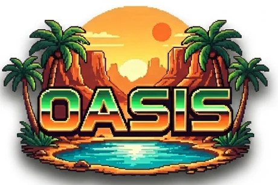
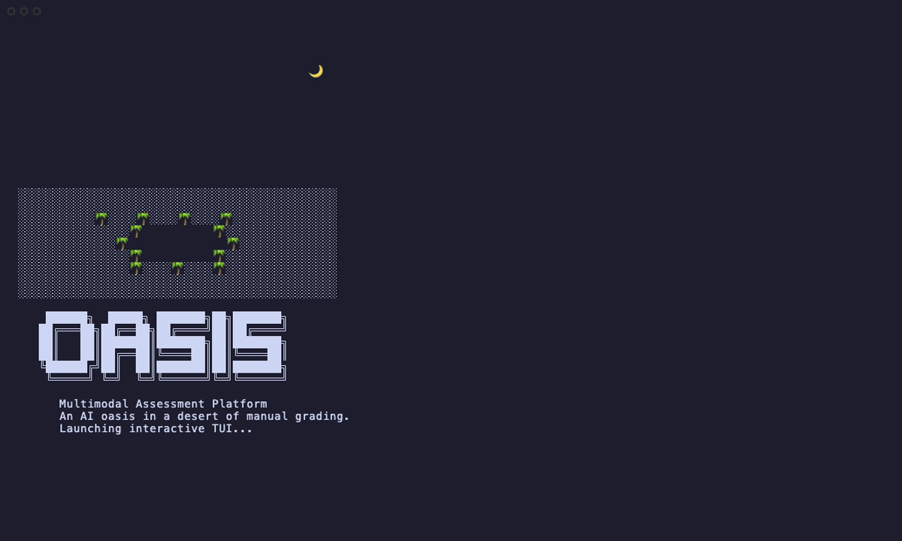
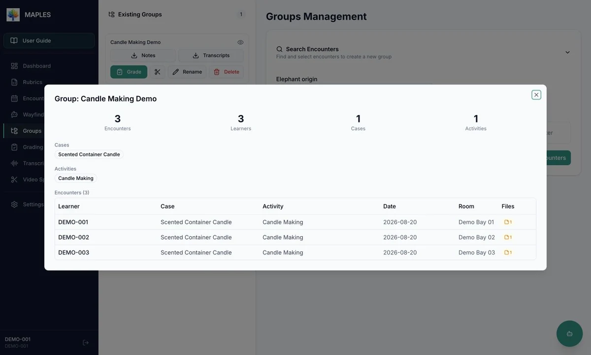
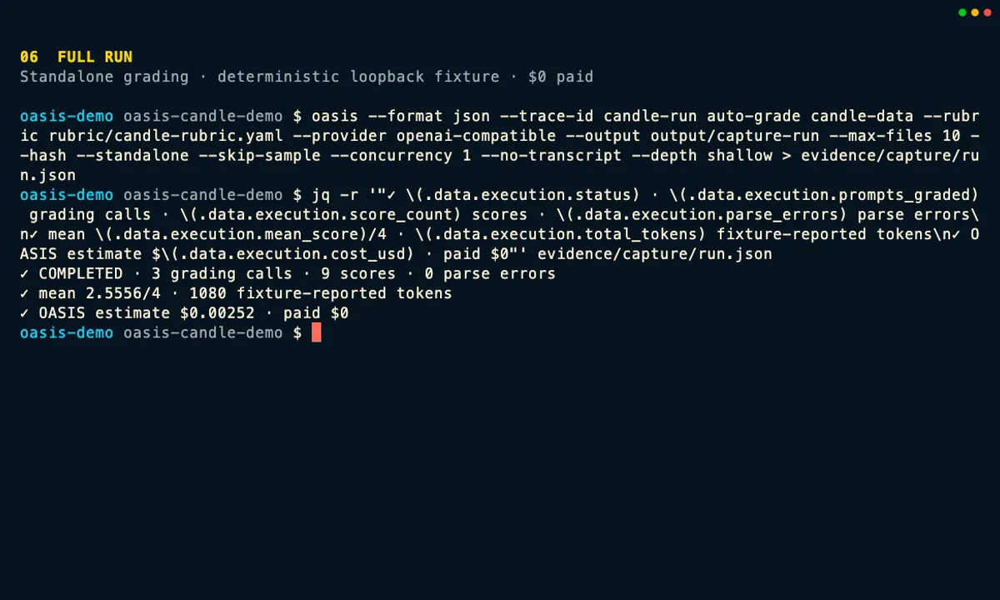

::: {.hero-panel}
{fig-alt="OASIS logo" width="460" height="307"}

::: {.hero-tagline}
An AI oasis in the desert of manual grading.
:::

::: {.hero-lede}
OASIS grades video, audio, and text against evaluator-defined rubrics, using hosted or self-hosted large language models. Modality-aware execution, provenance capture, and human review keep scores inspectable from rubric definition through adjudication.
:::
:::

## See OASIS in action

::: {.tour-teaser}
::: {.tour-teaser-copy}
### Explore the CLI & TUI

Step through the terminal interface, from startup readiness to workflow planning, live run monitoring, results inspection, provenance, and Elephant-backed data browsing. The tour uses sanitized recorded software demonstrations and does not contact a live service.

[Open the CLI & TUI tour](tui.qmd){.tour-cta}
:::

::: {.tour-teaser-media aria-hidden="true"}
{fig-alt="" loading="lazy" width="1200" height="720"}
:::
:::

::: {.tour-teaser .tour-teaser--reverse}
::: {.tour-teaser-copy}
### Explore MAPLES

Follow three coded synthetic encounters through group confirmation, rubric setup, station mapping, recorded run states, source-note inspection, and a staged, unsaved human review. The walkthrough contains no real learner data; displayed scores are fixture values, and visitors make no live-service or provider calls.

[Open the MAPLES tour](maples.qmd){.tour-cta}
:::

::: {.tour-teaser-media aria-hidden="true"}
{fig-alt="" loading="lazy" width="1200" height="720"}
:::
:::

::: {.tour-teaser}
::: {.tour-teaser-copy}
### Follow a complete CLI & MCP run

See OASIS take three coded synthetic Candle Making notes through local intake, file validation, a strict rubric check, call planning, a one-record sample, a full standalone run, a cache-backed MCP request, and evidence verification. The recorded workflow uses a deterministic loopback fixture, makes no external-provider calls, and incurs $0 paid spend.

[Open the Candle Maker tour](candle.qmd){.tour-cta}

[Download the overview GIF](assets/candle/candle-overview.gif){download="candle-overview.gif"}
:::

::: {.tour-teaser-media .tour-teaser-media--ambient}
```{=html}
<div class="ambient-terminal" data-ambient-terminal>
  
  <video id="homepage-candle-terminal" data-ambient-terminal-video autoplay muted loop playsinline preload="none" tabindex="-1" aria-hidden="true">
    <source data-src="assets/candle/candle-overview.webm" type="video/webm">
    <source data-src="assets/candle/candle-overview.mp4" type="video/mp4">
  </video>
  <span class="ambient-terminal-badge" aria-hidden="true">Recorded terminal · silent</span>
  <button type="button" class="ambient-terminal-toggle" data-ambient-terminal-toggle aria-controls="homepage-candle-terminal" aria-label="Play preview — recorded terminal" hidden>Play preview</button>
</div>
```
:::
:::

::: {.tour-overview-link}
[Browse all guided tours](explore.qmd)
:::

## Technical report

The report covers the platform's architecture, rubric-to-prompt compilation, multimodal grading pipeline, command-line and agent interfaces, provenance model, and operational experience.

- [Read the technical report online](paper/paper.html)
- [Download the technical report (PDF)](paper/OASIS_technical_report.pdf)

## Related projects and demonstrations

MAPLES is the platform's grading and review application. Wayfinder Rubric Studio is its authoring assistant; Wayfinder Operator is the distinct CLI/TUI sibling.

- [Explore UT-REAL, a multi-site MAPLES project](https://ut-real-ai-project-maples.com/)
- [Watch Ameer Hamza Shakur demonstrate the MAPLES grading and faculty-review workflow](https://www.youtube.com/watch?v=tHvS2kqRc2Q)
- [Watch Minhan Park and Licheng Yi demonstrate rubric authoring with Wayfinder in MAPLES](https://www.youtube.com/watch?v=MKwseFKuFLs)

## Publication scope

Project information, guided product tours, recorded software demonstrations, and this technical report are available at [github.com/JamiesonLabUTSW/oasis](https://github.com/JamiesonLabUTSW/oasis) and [jamiesonlabutsw.github.io/oasis](https://jamiesonlabutsw.github.io/oasis/). Each tour declares its synthetic or sanitized fixture and its live-service boundary. Application and component source code, binaries, installation materials, sample data, and tagged software releases are not part of this publication. Any future software release will identify its exact contents, version, and terms.

<script src="homepage-terminal.js" defer></script>
