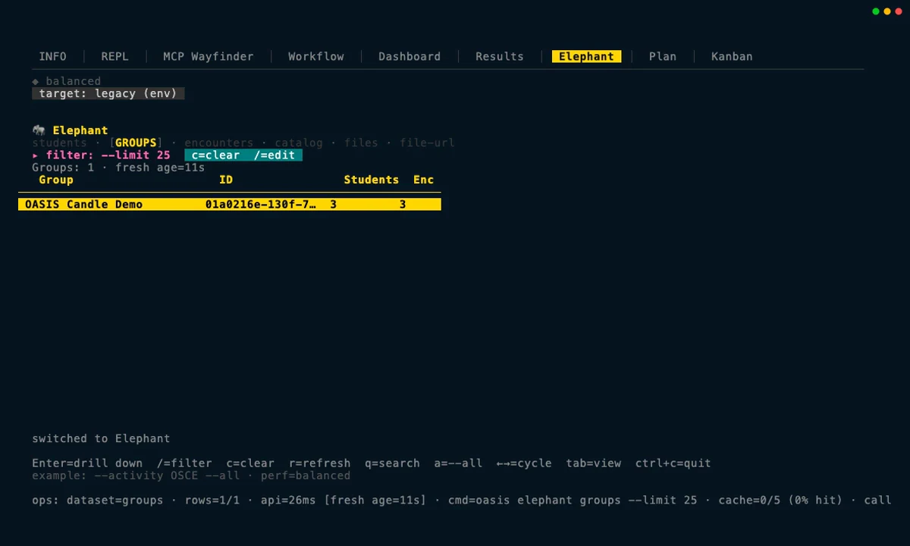

::: {.hero-panel}
{fig-alt="OASIS logo" width="460" height="307"}

::: {.hero-tagline}
An AI oasis in the desert of manual grading.
:::

::: {.hero-lede}
OASIS grades video, audio, and text with evaluator-defined rubrics and your choice of hosted or self-hosted language model. It plans each run around the material involved, records how every score was produced, and keeps people in control from rubric setup through final review.
:::
:::

## See OASIS in action

::: {.tour-teaser}
::: {.tour-teaser-copy}
### Explore the CLI & TUI

See how the terminal checks that OASIS is ready, builds a workflow, follows a run, opens results, traces evidence, and browses data stored in Elephant. Everything shown is a sanitized recording, so this page never connects to a live service.

[Open the CLI & TUI tour](tui.qmd){.tour-cta}
:::

::: {.tour-teaser-media aria-hidden="true"}
{fig-alt="" loading="lazy" width="1200" height="720"}
:::
:::

::: {.tour-teaser .tour-teaser--reverse}
::: {.tour-teaser-copy}
### Explore MAPLES

Follow three clearly labeled demo records through group setup, rubric review, station matching, run status, source-note inspection, and a human review that is deliberately left unsaved. There is no real learner data here: the scores are fixture values, and simply viewing the tour makes no service or model calls.

[Open the MAPLES tour](maples.qmd){.tour-cta}
:::

::: {.tour-teaser-media aria-hidden="true"}
{fig-alt="" loading="lazy" width="1200" height="720"}
:::
:::

::: {.tour-teaser}
::: {.tour-teaser-copy}
### Follow a complete CLI & MCP run

Watch OASIS check three synthetic Candle Making notes, validate the rubric, preview the work and estimated cost, try one note, run all three, reuse the results through MCP, and verify the evidence. The recording uses a predictable local test fixture, never calls an external model provider, and incurs $0 in provider charges.

[Open the Candle Making tour](candle.qmd){.tour-cta}

[Download the overview GIF](assets/candle/candle-overview.gif){download="candle-overview.gif"}
:::

::: {.tour-teaser-media .tour-teaser-media--ambient}
```{=html}
<div class="ambient-terminal" data-ambient-terminal>
  
  <video id="homepage-candle-terminal" data-ambient-terminal-video autoplay muted loop playsinline preload="none" tabindex="-1" aria-hidden="true">
    <source data-src="assets/candle/candle-overview.webm" type="video/webm">
    <source data-src="assets/candle/candle-overview.mp4" type="video/mp4">
  </video>
  <span class="ambient-terminal-badge" aria-hidden="true">Recorded terminal · silent</span>
  <button type="button" class="ambient-terminal-toggle" data-ambient-terminal-toggle aria-controls="homepage-candle-terminal" aria-label="Play preview — recorded terminal" hidden>Play preview</button>
</div>
```
:::
:::

::: {.tour-teaser .tour-teaser--reverse}
::: {.tour-teaser-copy}
### Load and check data in Elephant

Start with an agent-prepared manifest, let OASIS validate and preview it, pause for explicit approval, then open the imported group in the TUI and drill down through encounters and file counts. A final read-only CLI query confirms the stored file types, byte counts, and fingerprints.

[Open the Elephant ingestion tour](elephant.qmd){.tour-cta}
:::

::: {.tour-teaser-media aria-hidden="true"}
{fig-alt="" loading="lazy" width="1200" height="720"}
:::
:::

::: {.tour-overview-link}
[Browse all guided tours](explore.qmd)
:::

::: {.rubric-home-callout}
::: {.eyebrow}
New interactive guide
:::

### Improve a rubric, one decision at a time

Watch an intentionally vague bicycle brake-adjustment rubric evolve from v1 to v3. Prepared Rubric Maker-style feedback leads to a human-selected v2; a synthetic dry run exposes one more scoring problem; and that feedback produces a focused v3 candidate. Every source and version stays visible. It is an illustrative click-through—not a recorded Rubric Maker or grading run.

[Start the rubric improvement guide](rubric.qmd){.tour-cta}
:::

## Technical report

For readers who want the details, the report explains the architecture, how rubrics become model prompts, how each media type is graded, how the command-line and agent interfaces work, and how OASIS records evidence.

- [Read the technical report online](paper/paper.html)
- [Download the technical report (PDF)](paper/OASIS_technical_report.pdf)

## Related projects and demonstrations

MAPLES is the web application for grading and review. Wayfinder Rubric Studio helps authors build rubrics inside MAPLES, while Wayfinder Operator is the related—but separate—CLI/TUI experience.

- [Explore UT-REAL, a multi-site MAPLES project](https://ut-real-ai-project-maples.com/)
- [Watch Ameer Hamza Shakur demonstrate the MAPLES grading and faculty-review workflow](https://www.youtube.com/watch?v=tHvS2kqRc2Q)
- [Watch Minhan Park and Licheng Yi demonstrate rubric authoring with Wayfinder in MAPLES](https://www.youtube.com/watch?v=MKwseFKuFLs)

## Publication scope

This publication includes project information, interactive guides, recorded demonstrations, and the technical report. Each experience explains what data it uses and whether anything was connected live. It does not yet include application source code, binaries, installation packages, sample datasets, or a tagged software release; any future release will state exactly what it contains and which terms apply.

<script src="homepage-terminal.js" defer></script>
