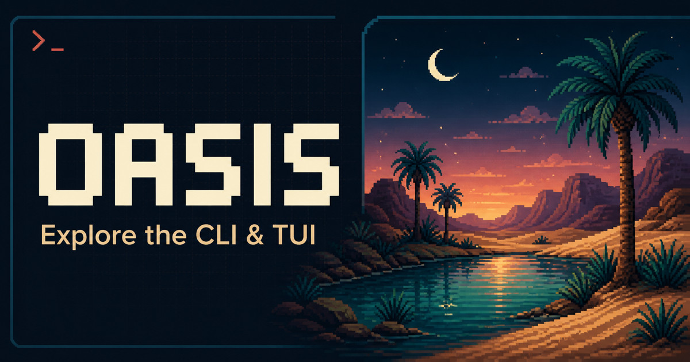

::: {.tui-tour-hero}

:::

::: {#tui-tour .tui-explorer data-product-tour="" data-tour-id="tui"}
::: {.tui-explorer-topline}
::: {.tui-explorer-heading}
::: {.eyebrow}
Interactive TUI tour
:::

<h2 id="tour-view-title" data-role="title">Start at the oasis</h2>

Launch into a readiness-aware workspace where every operation stays inspectable.

:::

::: {.tour-status aria-label="Tour status"}

Recorded · sanitized · offline
:::
:::

  <button type="button" role="tab" id="tour-tab-splash" aria-controls="tour-stage" aria-selected="true" tabindex="0" data-role="tab" data-step="splash">Splash & INFO</button>
  <button type="button" role="tab" id="tour-tab-dashboard" aria-controls="tour-stage" aria-selected="false" tabindex="-1" data-role="tab" data-step="dashboard">Dashboard</button>
  <button type="button" role="tab" id="tour-tab-workflow" aria-controls="tour-stage" aria-selected="false" tabindex="-1" data-role="tab" data-step="workflow">Workflow</button>
  <button type="button" role="tab" id="tour-tab-results" aria-controls="tour-stage" aria-selected="false" tabindex="-1" data-role="tab" data-step="results">Results</button>
  <button type="button" role="tab" id="tour-tab-elephant" aria-controls="tour-stage" aria-selected="false" tabindex="-1" data-role="tab" data-step="elephant">Elephant</button>

::: {#tour-stage .tui-stage data-role="stage" role="tabpanel" aria-labelledby="tour-tab-splash" tabindex="0"}
::: {.terminal-window}
<picture data-role="poster-frame">
  <source id="tour-image-source" data-role="poster-source" type="image/webp" srcset="assets/tui/splash-poster.webp">
  
</picture>

::: {.terminal-fallback data-tour-placeholder="" aria-hidden="true"}
OASIS
<strong data-role="placeholder-detail">Multimodal assessment, from plan to evidence.</strong>
Select a view above to explore the recorded interface.
:::
:::
:::

::: {.tour-controls}
<button type="button" class="tour-button" data-role="previous" disabled>← Previous view</button>
<button type="button" class="tour-button tour-button-primary" id="tour-next" data-role="next">Next view →</button>
<button type="button" class="tour-button" id="tour-watch" data-role="watch">Watch this flow</button>
<a class="tour-deep-link" id="tour-deep-link" data-role="deep-link" href="#splash" aria-label="Link to the current tour view">Link to this view</a>
:::

<noscript>
Interactive controls require JavaScript. The complete five-view description is available below.
</noscript>

:::

::: {.tour-notes}
::: {.tour-note-card}
### Plan before spending

OASIS resolves files, rubric prompts, modalities, providers, expected calls, and estimated cost before an execution begins.
:::

::: {.tour-note-card}
### Follow the evidence

Results remain connected to their run, execution plan, input identities, provider metadata, and review state.
:::

::: {.tour-note-card}
### Keep people in control

Confirmation gates, visible partial states, cancellation, and review handoffs make consequential actions explicit.
:::
:::

::: {.tour-method}
## What this tour represents

The interface recordings use deterministic or synthetic fixtures with credentials scrubbed. They demonstrate product interaction and layout, not a live grading claim. Motion is opt-in, pauses when closed, and is removed for visitors who prefer reduced motion.

The CLI and TUI are part of the OASIS software release process; this project page currently publishes demonstrations and the technical report only. Release materials will identify their exact contents and version when available.

For a longer operator example, [follow three coded Candle notes from standalone CLI intake through a cache-backed MCP run and verified evidence](candle.qmd). That walkthrough uses the real OASIS command and MCP surfaces against a deterministic loopback fixture, with its execution boundary stated on the page.

Read the five flow descriptions

1. **Splash & INFO:** The OASIS launch screen opens the INFO workspace, where readiness and available operations are summarized.
2. **Dashboard:** Four connected services report healthy status while the run list and selected run show progress and the next action.
3. **Workflow:** A mission is staged from sanitized inputs, then previewed as a dry-run plan before any execution.
4. **Results:** A synthetic result is selected and filtered; its score, evidence, rationale, inspection, and provenance remain in context.
5. **Elephant:** Sanitized example records are browsed from a dataset into encounters and files with keyboard-first navigation.

:::

